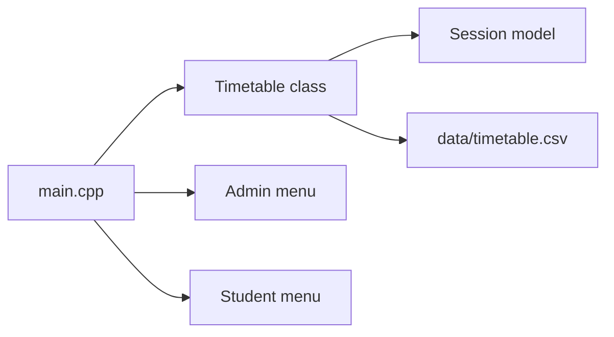

<div align="center">

# NTU Timetabling System

### Console app for managing university session schedules

[](https://isocpp.org/)
[]()
[]()

<br/>

[]()
[]()
[]()

<br/>

[](https://github.com/hackerbotfz/Terminal-University-timetable-system/commits)
[](https://github.com/hackerbotfz/Terminal-University-timetable-system)
[](https://github.com/hackerbotfz/Terminal-University-timetable-system/stargazers)

<br/>

**[Faiz Lawan](https://github.com/hackerbotfz)**

</div>

---

**NTU Timetabling System** is a C++ command-line application for scheduling university teaching sessions. Admins can add, edit, and delete sessions with conflict checks; students can browse, search, and export weekly timetables. Data persists in `data/timetable.csv`.

## Overview

| Detail | Value |
|--------|--------|
| **Interface** | Terminal menu (Admin / Student) |
| **Sessions** | Module, room, lecturer, type, group, week, day, hour |
| **Storage** | CSV load on startup, save on exit |
| **Validation** | Room, lecturer, and group clash detection |
| **Export** | Per-week CSV files (`Week_N_Timetable.csv`) |

## Architecture



`Session` holds one timetable entry. `Timetable` loads and saves the CSV store, enforces scheduling conflicts, and powers search, view, and export operations.

## Tech stack

C++17 · Standard library (`fstream`, `vector`, `algorithm`)

## Build & run

```bash
g++ -std=c++17 -o timetable src/main.cpp
cp data/timetable.example.csv data/timetable.csv
./timetable
```

On Windows (MinGW or MSVC):

```bash
g++ -std=c++17 -o timetable.exe src/main.cpp
copy data\timetable.example.csv data\timetable.csv
timetable.exe
```

## Repository

```
uni_timetable/
├── src/
│   └── main.cpp
├── data/
│   └── timetable.example.csv
├── .gitignore
├── LICENSE
└── README.md
```

## License

© Faiz Lawan. See [LICENSE](LICENSE).
